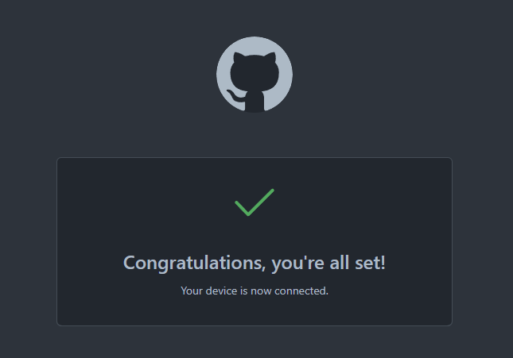
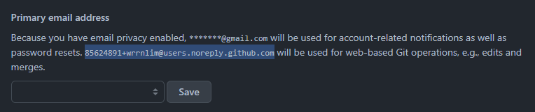

# GitHub CLI to Authenticate git for GitHub

[GitHub CLI](https://cli.github.com/) is the simplest way to access your GitHub repositories as you normally would using Git. Using GitHub CLI, we do not need to deal with SSH/GPG keys or Personal Access Tokens.

Firstly, install GitHub CLI. Check the [installation guide](https://github.com/cli/cli#installation) for your OS.

Once installed, simply run `gh auth login` to authenticate and follow the prompts. When asked for the protocol, select HTTPS, which is GitHub's recommended protocol. This also allows [GitHub Desktop](https://desktop.github.com/) to be used if you prefer a GUI over a CLI. If we use SSH for the protocol, the `.git/config` file in your repositories will have `git@github.com:username/repo.git` as the remote origin URL (instead of `https://github.com/username/repo.git`), which will cause authentication problems in GitHub Desktop.

When asked how you would like to authenticate, select "Login with a web browser." The CLI will give you an access code, and a browser will open up and prompt for the code. This allows you to log in without using any keys or tokens.

Once you see the following screen, you can continue using git as usual, with GitHub as the remote.


If you have not done so before, you will need to set your git config email and name, which will display on your commits. If you do not want to expose your email, GitHub provides you an anonymous email which you can view on your [email settings page](https://github.com/settings/emails).


Set your global git config with:

```bash
git config --global user.email "you@example.com"
git config --global user.name "Your Name"
```

## Some quick git commands

You can find a Git Cheatsheet by GitHub [here](https://education.github.com/git-cheat-sheet-education.pdf).

Clone a repo:

``` bash
git clone https://github.com/username/repo.git
```

Pull changes from remote:

```bash
git pull
```

Check local changes:

```bash
git status
```

Track all files in current directory:

```bash
git add .
```

Create a commit:

```bash
git commit -m "commit message"
```

Push commit to remote:

```bash
git push
```

View remote URL:

```bash
git remote -v
```
