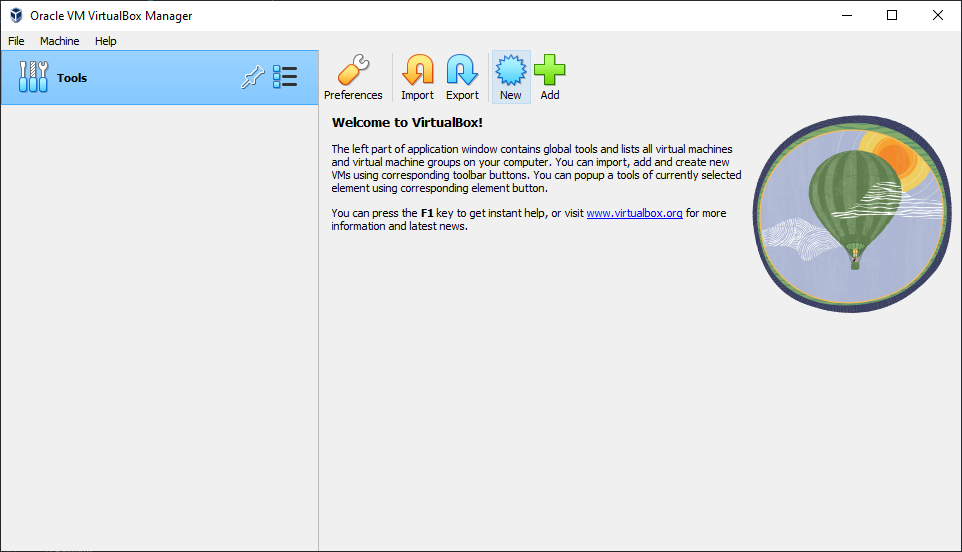
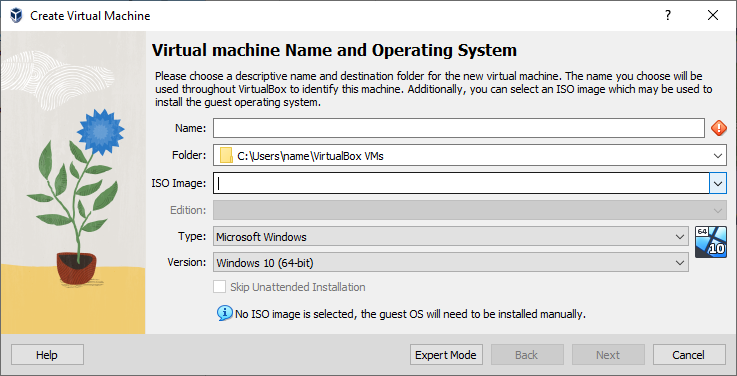
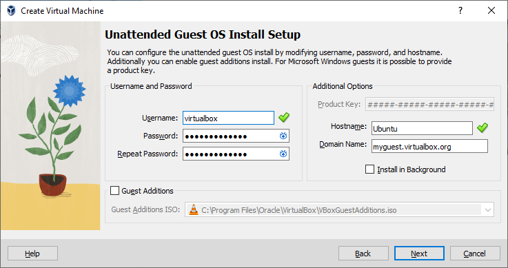
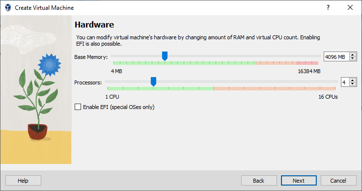
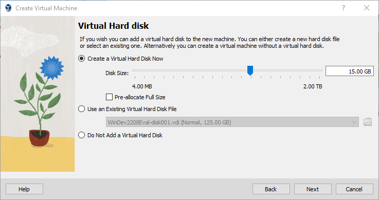
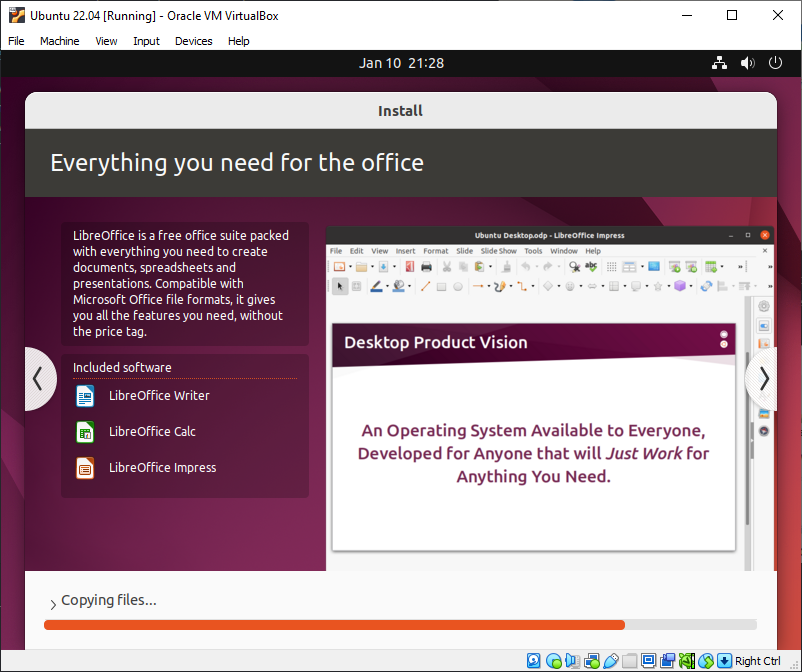
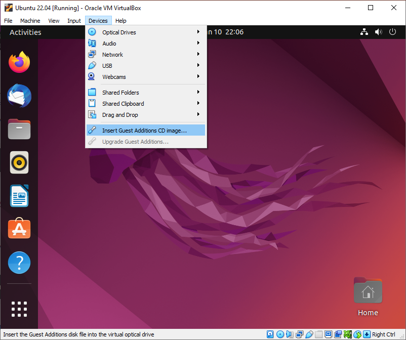
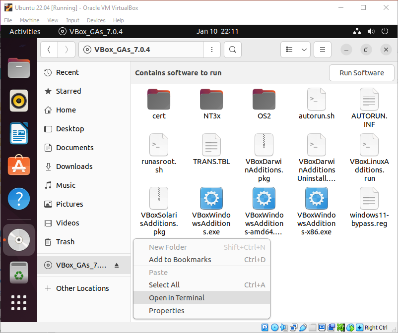
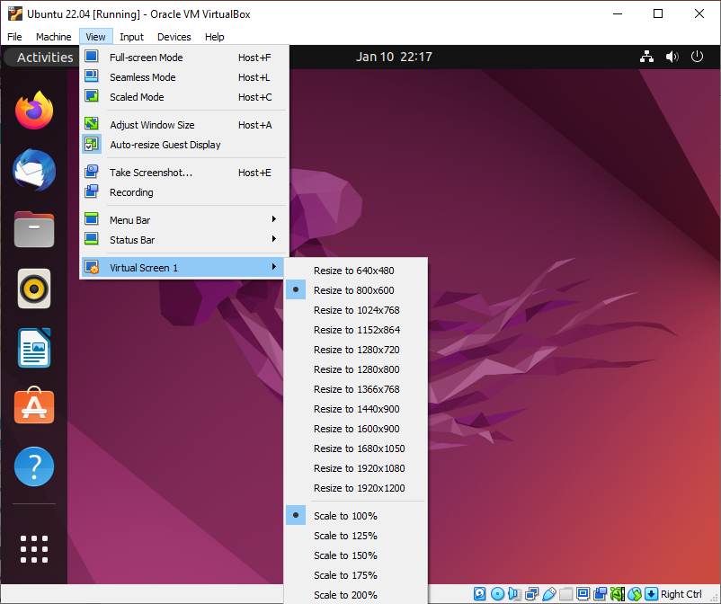

# Setting up Ubuntu VM

This guide will outline how to set up an Ubuntu virtual machine (VM) on [VirtualBox](https://www.virtualbox.org/)

## Prerequisites

Before we begin, we need to download the following

- [VirtualBox](https://www.virtualbox.org/wiki/Downloads) - this Oracle software allows us to create virtual machines.
- [Ubuntu Image](https://ubuntu.com/download/desktop) - this is the operating system for our VM. You may use any another Linux flavour.

## Set Up VM

Open VirtualBox and select "New" to create a new VM:


For the "ISO Image", select the dropdown -> other, and select the ISO image that you have downloaded in the above prerequisite step:


Give your VM any name and click "Next"

Set the username and password for your VM. This will be the user account, and will be used to access `root` and to use commands with `sudo`.



On the next screen, select the amount of RAM and CPU processors you want to allocate for your VM. Keep in mind that your host computer requires RAM and CPU resources as well, so try to allocate the minimum amount you need for your VM.



The next step is to create a virtual hard drive for the VM. As long as "Pre-allocated Full Size" is unchecked, the hard drive space will be dynamically allocated. This means that the VM will use as little space as possible, up to the maximum of what you set here.



Finally, the setup will show you a summary of the settings you have chosen. Click finish to complete setup. Your VM should now boot automatically. If not, select "Start." If you are using Ubuntu, the VM will automatically begin installing Ubuntu. You may have to follow the installation prompts for other Linux distributions.



Once the installation finishes, you have a working VM! However, you may notice a few issues that require fixing.

## The `sudo` Problem

If you try running a command with `sudo` in the terminal, you will get the following error:

```text
username is not in the sudoers file. This incident will be reported
```

We will need to manually add your user into the sudoers file. [This article](https://www.tecmint.com/fix-user-is-not-in-the-sudoers-file-the-incident-will-be-reported-ubuntu/) by Aaron Kili explains how to solve this problem. Below is a summary of the steps:

1. Boot into grub by restarting the VM and holding the shift key once you see the VirtualBox logo until the grub menu appears
2. Select "Advanced options for Ubuntu"
3. Select a version of Ubuntu with "(recovery mode)"
4. Select "root" to access a root shell. Enter your password (same password you set when setting up the VM)
5. Type `mount -o rw,remount /` to remount the file system in read and write mode, so we can edit the sudoers file.
6. Type `adduser username sudo`. Replace `username` with your username. If successful, you should see:

    ```text
    Adding user `username' to group `sudo' ...
    Adding user username to group sudo
    Done.
    ```

7. Type `exit` to exit the root shell and select "resume" to boot back into Ubuntu

## Screen Resolution Problem

If you try resizing the VirtualBox window, you will notice that the VM resolution stays at 800x600. This can be fixed by installing Guest Additions, which contains drivers and applications to optimize the VM experience. VirtualBox comes with the Guest Additions CD Image. In the VirtualBox toolbar, go to "Devices" and select "Insert Guest Additions CD image..."



This will mount the Guest Additions CD, which can be accessed from favourites bar. In some editions of Ubuntu, a popup may appear asking if you want to run the software. If there is a popup, select "Run" and enter your password to install Guest Additions. 



If there is no popup, open the CD in Files and right click -> Open in Terminal. Then type `sudo ./VBoxLinuxAdditions.run`. This will run the executable and install Guest Additions. Once it is finished, restart Ubuntu. If your host screen size is 1920x1080 or less, the VM screen will automatically resize to the VirtualBox window. If your screen size is larger, you may have to go to the VirtualBox taskbar, select "View" -> "Virtual Screen 1," select a smaller resolution with the same aspect ratio, and choose a larger scale.


